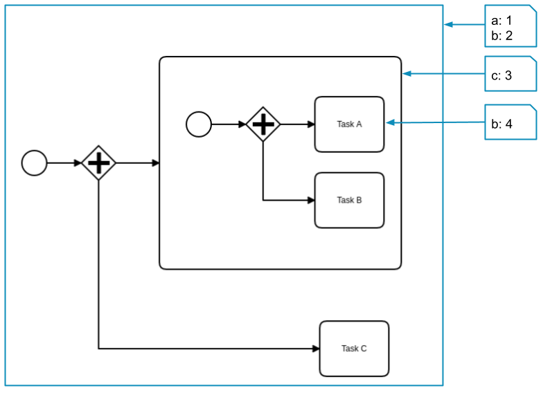
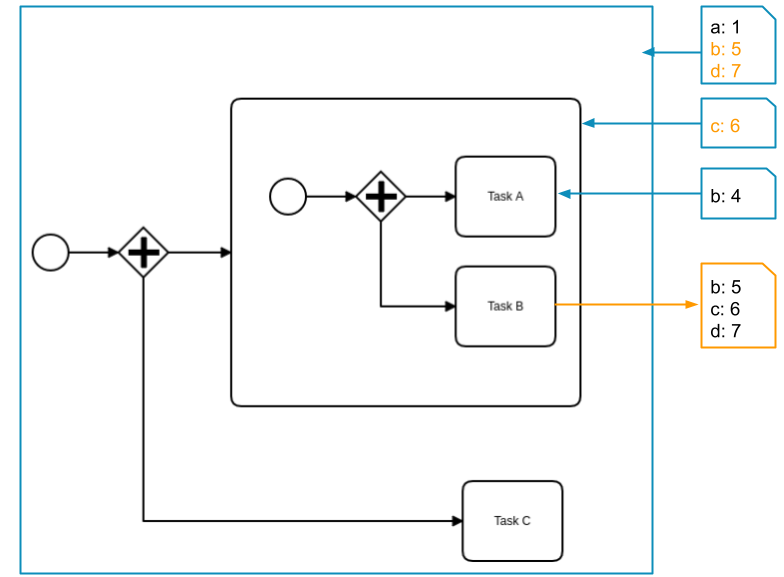
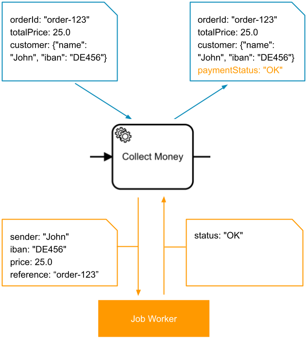
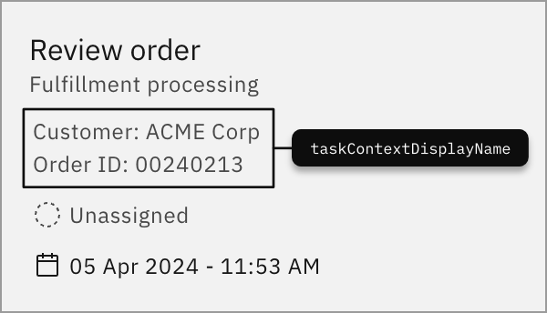

[Variables](/reference/glossary.md#variable) are part of a [process instance](/reference/glossary.md#process-instance) and represent the data of the instance.

A variable has a name and a JSON value. The visibility of a variable is defined by its variable scope.

When [automating a process using BPMN](/components/modeler/bpmn/automating-a-process-using-bpmn.md) or [orchestrating human tasks](../../guides/getting-started-orchestrate-human-tasks.md), you can leverage the scope of these variables and customize how variables are merged into the process instance.

## Variable names

The name of a variable can be any alphanumeric string including the `_` symbol. For a combination of words, it's recommended to use the `camelCase` or the `snake_case` format. The `kebab-case` format is not allowed because it contains the operator `-`.

When accessing a variable in an expression, keep in mind the variable name is case-sensitive.

Restrictions of a variable name:

- It may not start with a **number** (e.g. `1stChoice` is not allowed; you can use `firstChoice`instead).
- It may not contain **whitespaces** (e.g. `order number` is not allowed; you can use `orderNumber` instead).
- It may not contain an **operator** (e.g. `+`, `-`, `*`, `/`, `=`, `>`, `?`, `.`).
- It may not be a **literal** (e.g. `null`, `true`, `false`) or a **keyword** (e.g. `function`, `if`, `then`, `else`, `for`, `between`, `instance`, `of`, `not`).
- It must stay within the length limits of the target backend: up to **32,768 characters** with Elasticsearch/OpenSearch-backed secondary storage and up to **256 characters** with RDBMS-backed secondary storage.

:::note
Length is enforced using Java string length semantics rather than raw UTF-8 byte counts. Most common characters count as one character, while characters represented as surrogate pairs in Java count as two. Because of that, the effective visible-character limit can be lower for some inputs.
:::

## Variable values

The value of a variable is stored as a JSON value. It can have one of the following types:

- String (e.g. `"John Doe"`)
- Number (e.g. `123`, `0.23`)
- Boolean (e.g. `true` or `false`)
- Array (e.g. `["item1" , "item2", "item3"]`)
- Object (e.g. `{ "orderNumber": "A12BH98", "date": "2020-10-15", "amount": 185.34}`)
- Null (`null`)

:::note
Numbers are subject to the following numeric limits:

- Integer numbers are effectively limited to the 64‑bit integer range.
- Non‑integer numbers are stored as IEEE‑754 double‑precision values, which provide roughly 15–17 significant decimal digits rather than arbitrary BigDecimal precision.

If you need arbitrary-precision or very large numbers, consider storing them as strings or in an external data store instead of process variables.
:::

## Variable size limitation

The payload of a process instance is limited to 4 MB. This limit includes both process variables and workflow engine–internal data, so less than 4 MB is available for variables alone.

The effective limit depends on the operation. As a rule of thumb, ~1.5 MB is considered safe for commands or events that include variables, such as starting a process instance or completing a job. In these cases, the engine may append follow-up records that temporarily duplicate the variable payload within the same batch.

To avoid production issues, leave headroom below the limit—for example, target ≤1 MB—and validate with a production-like test case. If the payload size is uncertain, run a quick test to confirm behavior.

:::note
Regardless, we don't recommend storing much data in your process context. Refer to our [best practice on handling data in processes](/components/best-practices/development/handling-data-in-processes.md).
:::

## Variable scopes

Variable scopes define the _visibility_ of variables. The root scope is the process instance itself. Variables in this scope are visible everywhere in the process.

When the process instance enters a subprocess or an activity, a new scope is created. Activities in this scope can observe all variables of this and of higher scopes (i.e. parent scopes). However, activities outside of this scope can not observe the variables which are defined in this scope.

If a variable has the same name as a variable from a higher scope, it covers this variable. Activities in this scope observe only the value of this variable and not the one from the higher scope.

The scope of a variable is defined when the variable is created. By default, variables are created in the root scope.

This process instance has the following variables:

- `a` and `b` are defined on the root scope and can be seen by **Task A**, **Task B**, and **Task C**.
- `c` is defined in the subprocess scope and can be seen by **Task A** and **Task B**.
- `b` is defined again on the activity scope of **Task A** and can be seen only by **Task A**. It covers the variable `b` from the root scope.

### Variable propagation

When variables are merged into a process instance (e.g. on job completion, on message correlation, etc.) each variable is propagated from the scope of the activity to its higher scopes.

The propagation ends when a scope contains a variable with the same name. In this case, the variable value is updated.

If no scope contains this variable, it's created as a new variable in the root scope.

This automatic propagation behavior differs depending on the BPMN element:

- **Embedded subprocesses**: Local variables created in the subprocess (via input mappings) stay within the subprocess scope unless you explicitly propagate them with output mappings.
- **Call activities**: The child process runs in its own variable scope. You can configure which variables are passed to the child and which are returned to the parent using the call activity's variable propagation settings and input/output mappings.

The job of **Task B** is completed with the variables `b`, `c`, and `d`. The variables `b` and `c` are already defined in higher scopes and are updated with the new values. Variable `d` doesn't exist before and is created in the root scope.

### Local variables

In some cases, variables should be set in a given scope, even if they don't exist in this scope before.

To deactivate variable propagation, set the variables as **local variables**. This creates or updates the variables in the given scope, regardless of whether they existed in this scope before.

### Define local variables

To define a local variable in Modeler, add an input mapping on the activity, subprocess, or call activity where you want the variable to exist. For details on input mapping concepts (`source` and `target`) see [input/output variable mappings](#inputoutput-variable-mappings).

The `target` of the input mapping becomes a local variable in that element's scope. For example, an input mapping with `source: =customer.name` and `target: reviewerName` creates the local variable `reviewerName` in that scope.

### Scope behavior in common modeling patterns

The scope boundary depends on the BPMN element you use:

| Pattern                 | Scope behavior                                                                                                                                                                                                                                                                                                                         |
| ----------------------- | -------------------------------------------------------------------------------------------------------------------------------------------------------------------------------------------------------------------------------------------------------------------------------------------------------------------------------------- |
| Embedded subprocess     | Creates a local scope inside the same process instance. Local variables stay inside the subprocess unless you propagate them with output mappings. Root-scope process variables are still shared, so parallel or multi-instance embedded subprocess instances can overwrite the same process variable.                                 |
| Call activity           | Starts a new process instance with its own variable scope. Configure the call activity's parent variable propagation settings and input mappings to control which variables the child receives. Use the call activity's child variable propagation settings and output mappings to control which variables are returned to the caller. |
| Multi-instance activity | Each instance has its own local scope. Use input mappings to create per-instance local variables, especially in parallel multi-instance activities, to avoid race conditions when multiple instances update the same process variable.                                                                                                 |

If a form field or task variable should be different for each subprocess or each multi-instance instance, define it as a local variable with an input mapping instead of writing it directly to the root process scope.

:::tip When to use local variables
Use local variables to isolate data within a specific scope, especially for:

- **Per-instance data in multi-instance activities**: Create per-instance copies of variables to avoid race conditions when parallel instances update the same root process variable.
- **Subprocess-specific data**: Variables that should not affect sibling subprocess instances or the parent scope.
- **Task-specific context**: Variables computed for a single task that shouldn't persist to the process level.

Remember: Local variables are removed when a scope is exited unless you explicitly propagate them with output mappings.
:::

## Input/output variable mappings

Input/output variable mappings can be used to create new variables or customize how variables are merged into the process instance.

Variable mappings are defined in the process as extension elements under `ioMapping`. Every variable mapping has a `source` and a `target` expression.

The `source` expression defines the **value** of the mapping. It usually [accesses a variable](/components/modeler/feel/language-guide/feel-variables.md#access-variable) of the process instance that holds the value. If the variable or nested property doesn't exist, the value resolves to `null`. The same applies if you do not provide a `source`.

The `target` expression defines **where** the value of the `source` expression is stored. It can reference a variable by its name or a nested property of a variable. If the variable or the nested property doesn't exist, it's created.

Variable mappings are evaluated in the defined order. Therefore, a `source` expression can access the target variable of a previous mapping.

**Input mappings**

| Source          | Target      |
| --------------- | ----------- |
| `customer.name` | `sender`    |
| `customer.iban` | `iban`      |
| `totalPrice`    | `price`     |
| `orderId`       | `reference` |

**Output mapping**

| Source   | Target          |
| -------- | --------------- |
| `status` | `paymentStatus` |

### Input mappings

Input mappings can be used to create new variables. They can be defined on [service tasks](/components/modeler/bpmn/service-tasks/service-tasks.md), [script tasks](/components/modeler/bpmn/script-tasks/script-tasks.md), [business rule tasks](/components/modeler/bpmn/business-rule-tasks/business-rule-tasks.md), [call activities](/components/modeler/bpmn/call-activities/call-activities.md), [user tasks](/components/modeler/bpmn/user-tasks/user-tasks.md), [send tasks](/components/modeler/bpmn/send-tasks/send-tasks.md), and [subprocesses](/components/modeler/bpmn/subprocesses.md).

When an input mapping is applied, it creates a new [**local variable**](#local-variables) in the scope where the mapping is defined.

In Modeler, define these mappings in the element properties.

You can use [expressions](./expressions.md) or static values for input mappings. You can leave the `source` empty to map the `target` variable to `null`.

For string literals containing escaped characters (e.g., a newline character `\n`), the string is returned in its original form as expected (no double escaping is applied).

Examples:

| Process variables                      | Input mappings                                                                                               | New variables                               |
| -------------------------------------- | ------------------------------------------------------------------------------------------------------------ | ------------------------------------------- |
| `orderId: "order-123"`                 | **source:** `=orderId`  **target:** `reference`                                                          | `reference: "order-123"`                    |
| `customer:{"name": "John"}`            | **source:** `=customer.name` **target:** `sender`                                                        | `sender: "John"`                            |
| `customer: "John"` `iban: "DE456"` | **source:** `=customer`  **target:** `sender.name` **source:** `=iban` **target:** `sender.iban` | `sender: {"name": "John", "iban": "DE456"}` |
| -                                      | **source:** `"Peter"` **target:** `sender`                                                               | `sender: "Peter"`                           |
| `customer:{"name": "John"}`            | **source:** (not provided) **target:** `customer`                                                        | `customer: null`                            |

### Output mappings

Output mappings can be used for several purposes:

- To customize how variables are merged into the process instance.
- They can be defined on service tasks, receive tasks, message catch events, and subprocesses.
- They can be used in script and user tasks.

If **one or more** output mappings are defined, the results variables are set as **local variables** in the scope where the mapping is defined. Then, the output mappings are applied to the variables and create new variables in this scope. The new variables are merged into the parent scope. If there is no mapping for a job/message variable, the variable is not merged.

:::note
This can lead to a case where some variables with an output mapping are merged into the parent scope, and others without an output mapping are not merged.
:::

If **no** output mappings are defined, all results variables are merged into the process instance.

In the case of a subprocess, the behavior is different. There are no results variables to be merged. However, output mappings can be used to propagate **local variables** of the subprocess to higher scopes. By default, all **local variables** are removed when the scope is left.

Examples:

| Results variables                                    | Output mappings                                                                                                                      | Process variables                                  |
| ---------------------------------------------------- | ------------------------------------------------------------------------------------------------------------------------------------ | -------------------------------------------------- |
| `status: "Ok"`                                       | **source:** `=status` **target:** `paymentStatus`                                                                                | `paymentStatus: "OK"`                              |
| `result: {"status": "Ok", "transactionId": "t-789"}` | **source:** `=result.status` **target:** `paymentStatus` **source:** `=result.transactionId` **target:** `transactionId` | `paymentStatus: "Ok"` `transactionId: "t-789"` |

:::note
Avoid using output mappings or result variables that contain a period (for example, `customer.name`). Using a period is discouraged because it updates a property of an existing process variable within the task scope, which can lead to confusing behavior or unexpected results in the process flow.
:::

### Context variable

A context variable is a reserved variable that describes the context of a task. It can group variables together to provide a detailed description of the task or offer more descriptive data about it.
The reserved variable name for a context variable is `taskContextDisplayName`. This name is reserved exclusively for this purpose and should not be used for other variables.

:::warning
Context variables are not supported in Tasklist V2. See [migration from V1 to V2](../tasklist/api-versions.md#migration-from-v1-to-v2).
:::

Example:

| Input variable           | Example                              |
| ------------------------ | ------------------------------------ |
| `taskContextDisplayName` | `This is a context variable example` |

The data from the variable will be shown on the task tile, as shown in the example below:

## Next steps

- Understand how to [access variables](/components/modeler/feel/language-guide/feel-variables.md).
- Explore how to centrally manage cluster configuration with [cluster variables](../../components/modeler/feel/cluster-variable/overview.md).
