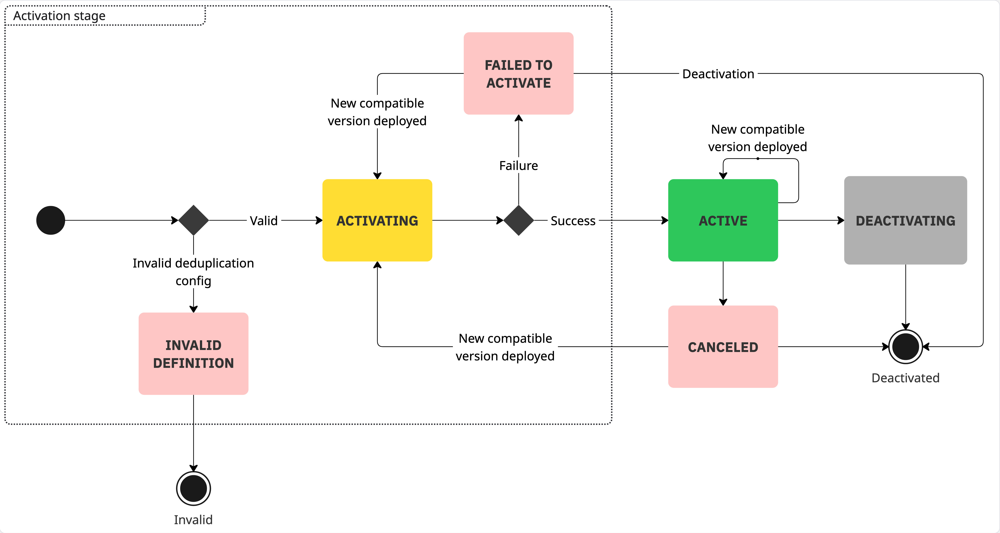

Inbound

Inbound connectors in Camunda have a lifecycle that depends on process definition deployments.
It is important to understand this lifecycle to work with inbound connectors effectively.

This page explains when inbound connectors are activated and deactivated, what can affect their execution, and how to monitor their status.

## Inbound connector executables

An executable is an instance of an inbound connector that is managed by the connector runtime.

An executable is mapped to one or more process definitions deployed to the engine.
In the simplest case, deploying a new process definition will create a new executable in the connector runtime.
However, in general, one executable can be reused for multiple inbound connector elements in the diagram. To learn how the runtime reuses executables across connectors, see [Inbound connector deduplication](./deduplication.md).

## Reacting to process definition deployments

The connector runtime maintains an internal state that tracks:

- Latest versions of process definitions.
- Previous process-definition versions with active message subscriptions.

The following endpoints of the Orchestration Cluster API are used as data sources:

- [Search process definitions](/apis-tools/orchestration-cluster-api-rest/specifications/search-process-definitions.api.mdx)
- [Search message subscriptions](/apis-tools/orchestration-cluster-api-rest/specifications/search-message-subscriptions.api.mdx)

If a process definition matches at least one of these two criteria (i.e. it is either the latest version of that process definition, or it has active instances waiting on message subscriptions), the connector runtime will create an executable for every inbound connector element in that process and keep it active as long as these criteria are met.

If a process definition is deleted from the engine; or it is replaced with a newer version of the same process, and has no active message subscriptions, the connector runtime will deactivate the related executables.

## Lifecycle overview

The lifecycle of an executable starts when the connector runtime detects a change in the engine state and determines that it needs a new executable to reflect that change.

- `INVALID_DEFINITION` – The runtime detects an invalid deduplication configuration and stores the executable in this state. For details about supported configurations and common causes, see [Inbound connector deduplication](./deduplication.md).

- `FAILED_TO_ACTIVATE` – The runtime attempts to activate the executable, but the activation fails. The executable remains inactive in this state.

- `ACTIVE` – The runtime successfully activates the executable. In this state, the executable is ready to receive and process external events from the third-party system.

- `CANCELED` – An active executable encounters an unrecoverable error and transitions to this state. This is rare, as most connectors include retry logic to handle transient failures such as temporary network issues.

When you deploy a new process version, the connector runtime checks whether it can deduplicate inbound connectors in the new version with any currently active executables. If deduplication is possible, the runtime updates the existing executable. If the executable is inactive (for example, in the `CANCELED` or `FAILED_TO_ACTIVATE` state), the runtime also attempts to restart it.

When the executable is no longer needed—for example, when its originating process version is no longer the latest and no active instances are waiting on message subscriptions—the runtime deactivates it.
