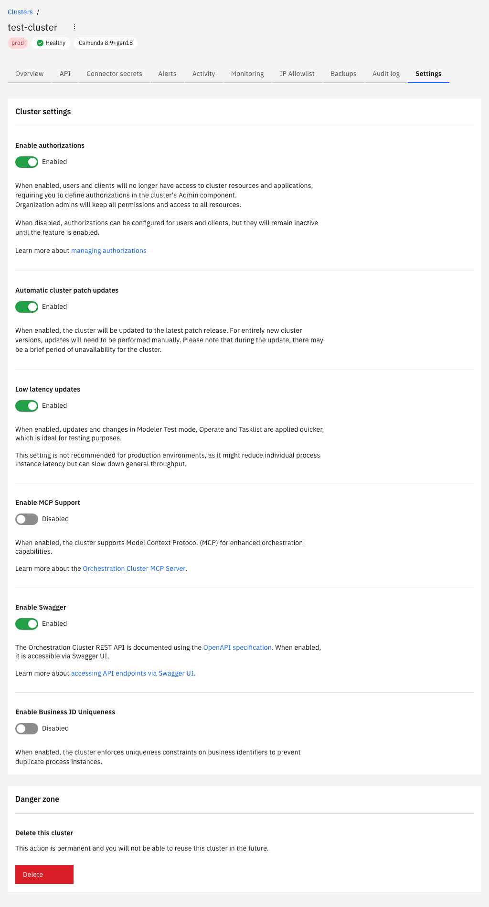

Manage your cluster settings using authorizations, automatic cluster updates, and user task restrictions, or permanently delete the cluster.

## Manage cluster settings

To manage your cluster settings:

1. Navigate to **Console**, and select the **Clusters** tab.
2. Select the cluster you want to manage, and select the **Settings** tab.
3. Enable/disable cluster settings as required, or delete the cluster.

## Authorizations

You can enable authorizations on a per-cluster basis to control the level of access users and clients have over Orchestration Cluster resources.

- Enable this setting to use [authorizations](/components/concepts/access-control/authorizations.md) in the cluster.
- Disable this setting if you do not want to use authorizations in the cluster. You can still configure authorizations in the Orchestration Cluster Admin, but they are only applied to the cluster when you enable this setting.

:::tip
Learn more about [resource-based authorizations](/components/concepts/access-control/authorizations.md).
:::

## Multi-tenancy

You can enable multi-tenancy checks on a per-cluster basis to enforce tenant-level authorization for Orchestration Cluster resources.

- Enable this setting to enforce tenant-level authorization checks. Users, groups, and roles not assigned to a tenant lose access to any resources scoped to that tenant.
- Disable this setting to allow tenants to be created and principals assigned without enforcing checks. All data maps to the `<default>` tenant.

This setting is disabled by default. Only organization admins can change it, and it is available for clusters running generation 8.8 and later. The setting is reversible: disabling it restores the implicit `<default>`-tenant behavior.

For details on creating tenants and managing assignments, see [tenant management](/components/admin/tenant.md).

:::warning
Before you enable multi-tenancy checks, assign all users, groups, and roles that need access to their tenants and to the `<default>` tenant. Once checks are enforced, any principal not assigned to a tenant loses access to the resources scoped to that tenant.
:::

## Enable App Integrations

You can allow a cluster to exchange user task events with App Integrations, such as Camunda for Microsoft Teams, so task notifications can be delivered to your collaboration tool.

- Enable this setting to deliver user task notifications to Microsoft Teams based on your [notification rules](/components/camunda-integrations/ms-teams/ms-teams-notifications.md). Notification cards also update as the task is assigned, completed, or canceled.
- Disable this setting if you do not want the cluster to send user task events. Notifications are not delivered. You can still use Camunda for Microsoft Teams to browse tasks, start processes, and act on tasks.

This setting is disabled by default. It is available for clusters running generation `8.9+gen13` and later, and organization admins can change it.

## Automatic cluster updates

You can set the cluster to automatically update to newer versions of Camunda 8 when they are released.

- Enable this setting to automatically update the cluster when a new patch release is available. During an update, the cluster may be unavailable for a short time. You can still manually update the cluster.
- Disable this setting if you do not want the cluster to automatically update. You must manually update the cluster.

:::tip
For more information on updating clusters, see [update your cluster](/components/console/manage-clusters/manage-cluster.md#update-a-cluster).
:::

## Enforce user task restrictions

You can enable user task access restrictions in the cluster to restrict Tasklist task access to assigned/candidate users and groups.

:::caution Tasklist V1 only
User task access restrictions are supported only by the Tasklist V1 API and are not available in Tasklist V2. From Camunda 8.8, Tasklist runs in V2 mode by default.

To continue using user task access restrictions, see [switching between V1 and V2 modes](components/tasklist/api-versions.md#switching-between-v1-and-v2-modes) to enable Tasklist V1 mode.

In Tasklist V2, task visibility is controlled by authorization-based access control rather than user task access restrictions. For a conceptual overview of how authorizations control access to user tasks, see [authorization-based access control](../../concepts/access-control/authorizations.md).
:::

- Enable this setting to use user task access restrictions in the cluster when Tasklist V1 is enabled. Tasks assigned to users or candidate groups are only visible to assigned users or respective group members.
- Disable this setting if you do not want to use user task access restrictions in the cluster. Any user can see any task, regardless of the assignment. Use this mode in development environments to test assignment rules.

Changes to this setting can take a few minutes to be applied, as it requires a Tasklist restart.

:::tip
For more information on user task access restrictions, see [user task access restrictions](/components/tasklist/user-task-access-restrictions.md).
:::

## Delete this cluster

You can _permanently_ delete the selected cluster. See [delete your cluster](/components/console/manage-clusters/manage-cluster.md#delete-a-cluster).

:::caution
Deleting a cluster is permanent. You cannot reuse a cluster after it has been deleted.
:::
