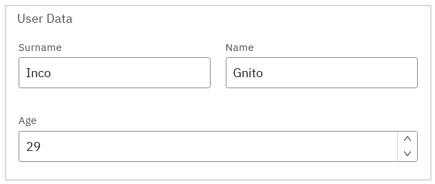

## Binding form fields to process data

### Overview

Each **form element** that allows data manipulation is considered a **form field** and has a **Key** attribute. The "Key" serves a dual purpose:

1. To map data to the field during the initial loading of the form.
2. To map the field's data back to the process variable during form submission.

When a form is part of a user task or start event and viewed in [Tasklist](../../../tasklist/introduction-to-tasklist.md), the "Key" correlates with a process variable. This variable serves as the initial value of the field and is updated upon form submission.

### Simple key vs path key

#### Simple key

Traditionally, a key was defined as a simple variable name. This key directly matches a process variable.

```
key: "username"
```

#### Path as key

With newer updates, keys can now also be defined as a path, like `user.info.age`. This allows for more complex data structures.

```
key: "user.info.age"
```

Setting this field to value `21` would lead to the following output data:

```
{
  "user": {
	"info": {
	  "age": 21
	}
  }
}
```

### Path extension via groups

In a form that utilizes **groups**, the group's **path** acts as a prefix to the key of each child field within that group. This effectively extends the key and allows for more intricate data mapping.

For example, if the group's path is `user.info`, and a child field has a key of `age`, the complete key would become `user.info.age`. This is particularly useful to deal with nested data structure inputs and outputs.



If the above group has a path set to `user.info`, and if each field's key matches its label, the resulting output data will look like this:

```
{
  "user": {
    "info": {
      "surname": "Inco",
      "name": "Gnito",
      "age": 29
    }
  }
}
```

Group paths can be shared by multiple groups, as long as fields themselves do not conflict. However, depending on your use case, it might make sense for your visual and data structure to match.

### Path configuration for dynamic lists

While dynamic lists share similarities with groups in form structuring, they differ slightly in terms of path configuration. Since dynamic lists are bound to arrays, they cannot share paths with other dynamic lists or groups.

In this instance, consider a dynamic list with the path `contacts`. Each entry in the list might contain fields like `name` and `phone`. The dynamic list directly outputs an array of objects under its own path, and the key of those child variables is used in the creation of the individual objects. The resulting data structure would resemble:

```
{
  "contacts": [
    {
      "name": "John Doe",
      "phone": "123-456-7890"
    },
    {
      "name": "Jane Smith",
      "phone": "098-765-4321"
    }
    // Additional objects for each item in the list
  ]
}
```

This structure is maintained when binding to input data as well. You can programmatically control how many list items are rendered from the number of elements in the array at the binding path, whether individual element data is provided or not.
