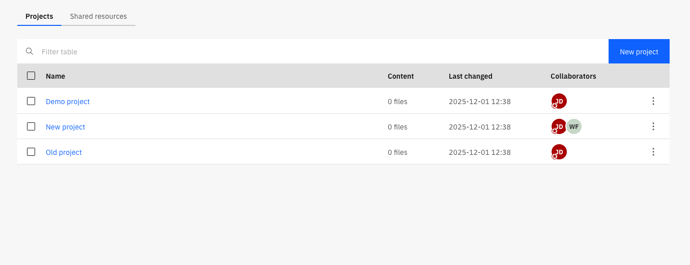
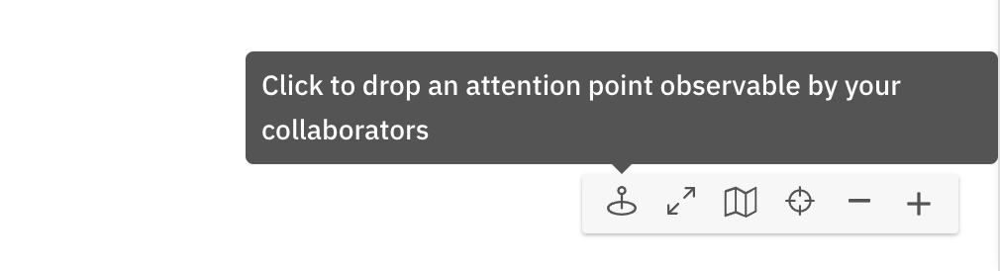
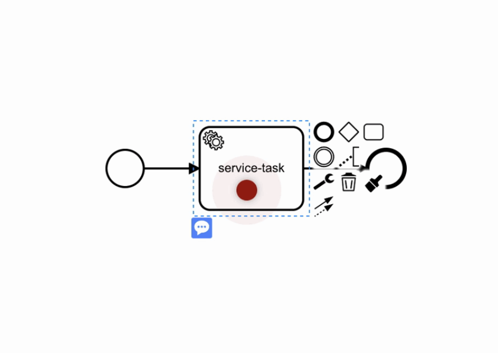

import BulkAddUserImg from '../img/invite-all-organization-members.png';
import SuperUserModeImg from '../img/super-user-mode.png';
import Tabs from "@theme/Tabs";
import TabItem from "@theme/TabItem";

## Projects

In SaaS, projects contain process applications. Process applications contain files and folders. In Self-Managed, projects can contain files, folders, and process applications. However, in preparation for [8.10](/docs/reference/announcements-release-notes/8100/whats-new-in-810.md#organizational-structure), Camunda recommends storing files and folders in process applications, regardless of your deployment.

User access to files and folders is defined at the project level.

When you access Web Modeler via the Camunda 8 dashboard, you can note the **Home** page with all the projects you can access:

### Access rights and permissions

Users can have various levels of access to a project in Web Modeler, outlined in this section.

After creating a project, you can invite members of your Camunda 8 organization to collaborate in Web Modeler.
There are four roles with different levels of access rights that can be assigned to each user:

- **Project Admin**: The user can edit the project itself, all folders, and diagrams within the project, and invite more users to collaborate.
- **Editor**: The user can edit all folders and diagrams within the project.
- **Commenter**: The user cannot edit folders or diagrams or invite users, but can view diagrams and properties and leave comments.
- **Viewer**: The user cannot edit folders or diagrams nor leave comments, but can only view diagrams.

Additionally, users with elevated access have special privileges to do administrative tasks in **super-user mode**.

#### Super-user mode

Super-user mode is only available to users with elevated access and can be enabled via the user menu in Web Modeler:

The main purpose of this mode is to assign collaborators to orphaned projects (which have no collaborators).
Ordinarily, these projects would not be accessible or visible to any users.

When a user activates super-user mode, they are temporarily granted **Project Admin** access to all projects
of the organization. This allows them to assign collaborators to orphaned projects and gives them
full access when none of the ordinary collaborators are available.

##### Required roles/permissions for super-user mode access {#elevated-access}

<Tabs groupId="permissions" defaultValue="saas" queryString values={
[
{label: 'SaaS', value: 'saas' },
{label: 'Self-Managed', value: 'self-managed' },
]}>

<TabItem value='saas'>

The user must be assigned the organization **Owner** or **Admin** role.

</TabItem>

<TabItem value='self-managed'>

The user must be assigned the **Web Modeler Admin** role.

If the role is not pre-existing, it can be created with the following permissions:

- Web Modeler Internal API - `write:*`
- Web Modeler Internal API - `admin:*`
- Camunda Identity Resource Server - `read:users`

Refer to the documentation pages about [assigning roles](../../../../self-managed/components/management-identity/application-user-group-role-management/manage-roles.md) and [adding permissions](/self-managed/components/management-identity/access-management/access-management-overview.md) for detailed instructions.
</TabItem>

</Tabs>

### Add users to projects

Invite collaborators by taking the steps below:

1. Open a project.
2. On the right side of the project view, under **Collaborators**, click **Add user**.
3. Choose a role for your new collaborators.
4. Search for and select the collaborators from your organization to invite to the project. To add collaborators who are not already members of the organization, provide their email addresses.
5. Write a message to your new collaborators about their invitation to the project.
6. Click **Add users**.

Your new collaborators will be added to the project and notified via email. Users without email addresses will not receive any kind of notification about project invitations.

:::note
If the individual is not a member of your organization, they will first receive an organization invitation.
After accepting the invitation and logging into Web Modeler, they will be added to the project.
They will have a "pending" label in the collaborator list until they accept.
:::

#### Invite the entire organization

To invite all existing members of your Camunda 8 organization to a project at once:

1. Open a project.
2. On the right side of the project view, under **Collaborators**, click **Add user**.
3. Choose a role for your new collaborators.
4. Click the email address input field, and select **All users in the organization**.

:::info Self-Managed license restrictions
For Self-Managed non-production installations, the number of collaborators per project is limited to **five**, including the project administrator.

For more information, refer to the [licensing documentation](/reference/licenses.md#web-modeler).
:::

### Folders

Use folders to semantically group and organize your diagrams.

In SaaS, folders are stored in process applications, the root-level container within a project. In Self-Managed, you can store folders in process applications or directly in the project. However, in preparation for [8.10](/docs/reference/announcements-release-notes/8100/whats-new-in-810.md#organizational-structure), Camunda recommends storing all files and folders in process applications, regardless of your deployment.

User access to a folder is inherited from the project.

## Sharing and embedding diagrams

Diagrams can also be shared with others in read-only mode via a sharing link.
This link can also be protected with an additional password.

1. Open a diagram.
2. In the top right corner of the modeler view, open the vertical ellipsis menu, and select **Share**.
3. Click **Create link**.
4. (Optional: Protect this link with a password) At the bottom of the modal, next to **Password protect**, click **Add**, and type a password.
5. Share or use the link with one of the following methods:
   - Click **Copy** to share the URL directly.
   - Click **Embed** to copy an `iframe` HTML tag.
   - Click **Email** to share the new link with multiple email recipients.

:::tip
For wiki systems like [Confluence](https://www.atlassian.com/software/confluence), we recommend using the HTML macro and adding the iframe tag from the sharing dialog. This way, diagrams can be easily included in documentation pages. To adjust the dimensions of the diagram, the width and height values of the `iframe` tag can be modified.
:::

## Comments

Use comments to discuss your diagram:

1. Open a diagram.
2. On the right side of the modeler view, in the **Details** panel next to **Properties** and **Test**, select the **Comments** icon.

If a single element is selected, the comments in this panel only apply to the selected element. Otherwise, they apply to the entire diagram.

:::tip
Elements with comments have a **Comment** icon in the diagram.
:::

If you have Admin, Editor, or Commenter access rights, you can:

- Add a new comment.
- Edit or delete a comment with the vertical ellipsis menu on the comment.

### Mention others in comments

When leaving a comment, type the **@** character to filter and select a project collaborator. When submitting the comment, this user will receive an email as a notification about the new comment.

:::note
Users without email addresses will not receive any kind of notification about being mentioned in a comment.
:::

## Interact with your collaborators

### Model a diagram together

When others are opening the same diagram as you, the updates on the diagram are sent in real time. You can also see who is in the diagram with you.

### Canvas lock

To prevent conflicts and broken sessions when multiple people open the same diagram, Web Modeler automatically locks the canvas.

When a user with edit permissions starts editing a diagram, the canvas is automatically locked. While the lock is active, no other users can modify the diagram — this prevents conflicting edits.

Other collaborators can still do the following:

- Open and view the diagram in real time
- Switch [modes](./collaborate-with-modes.md)
- Navigate the canvas
- Drill down into subprocesses
- Inspect properties and linked assets
- Add comments (if they have permission)

#### Take over editing

If another user with edit permissions needs to continue working, they can take control by clicking the **Take over** button in the canvas lock bar.
This releases the current lock and immediately assigns edit control to the new user.

This approach enables predictable handovers and prevents conflicting edits while keeping the diagram accessible to all viewers.

### Undo/redo management limitations

When collaborating with others on a diagram, you can only undo or redo your own actions until another collaborator makes a change, as the undo/redo history is reset each time another collaborator makes a change.

### Draw other's attention

Whether you are in a presentation or if others are in the same diagram as you are, use the attention grabber pointer to draw attention to a specific part of the diagram. To do this, take the following steps:

1. Switch on the attention grabber pointer from the canvas tools.
   

2. Drop the pointer by clicking anywhere on the canvas.
   

The pointer will pulsate to draw attention and will match your avatar color.
It can also be seen in real-time by others that are looking at the same diagram as you.
