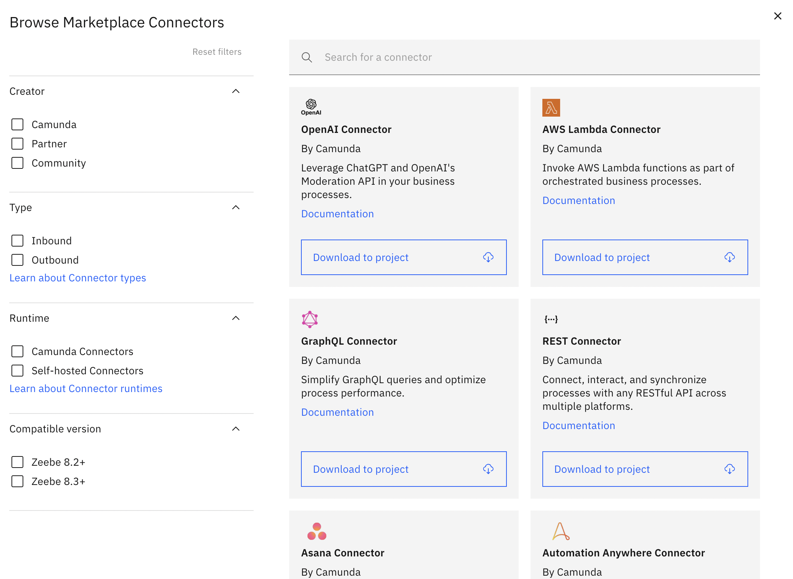
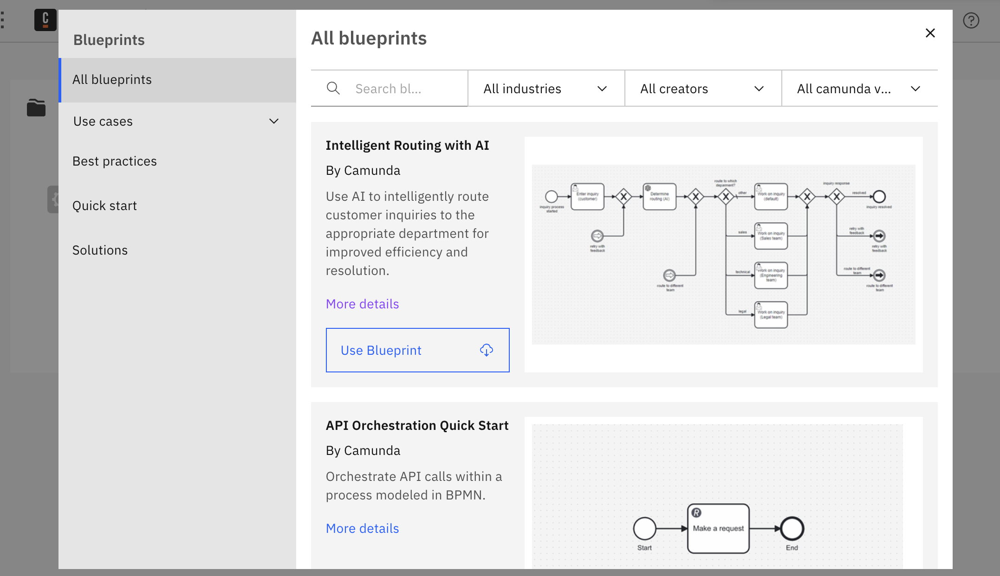

Discover the **Camunda Marketplace**, your go-to destination for leveraging various contributions from the Camunda community, trusted partners, and the Camunda team.

Follow our intuitive guides to explore and harness connectors and blueprints using Web Modeler. If you prefer to utilize these resources within Desktop Modeler, download them directly from the [Camunda Marketplace website](https://marketplace.camunda.com).

If you are a **[Web Modeler Self-Managed](/self-managed/components/modeler/web-modeler/overview.md)** user, be aware that your organization may restrict access to marketplace resources. If you are unsure about your organization's access, contact your organization's owner for clarification.

## Browse Marketplace connectors

:::note
Connectors created by partners or the community are not part of the commercial Camunda product. Camunda does not support these connectors as part of its commercial services to enterprise customers. Please evaluate each client to make sure it meets your requirements before using.
:::

To navigate to the Camunda Marketplace, take the following steps:

1. Log in to your Camunda account.
2. Click on an existing project, or create a new project by clicking **New project**.
3. In the project, create or open a process application. Storing files in a process application is required for SaaS. In preparation for [8.10](/docs/reference/announcements-release-notes/8100/whats-new-in-810.md#organizational-structure), it's also recommended for Self-Managed.
4. In the process application, click **Create new > BPMN diagram**.
5. In your BPMN diagram, select an element.
6. In the properties panel on the right side of the screen, click **Template > Select**.
7. In the top right corner of the **Choose element template** modal, click the **blue shop icon**.
8. Browse [available connectors](/components/connectors/out-of-the-box-connectors/available-connectors-overview.md), tick the boxes on the left side of the modal to implement filters, and search for a specific connector by typing in the **Search for a connector** search bar.
   

:::note
Want to learn more about a connector before applying it to your diagram? Every connector in the Camunda Marketplace offers additional documentation by clicking the **Documentation** link inside the connector's box. This will open a new tab in your browser of the [Camunda Marketplace](https://marketplace.camunda.com/) and additional details for the connector you selected.
:::

## Download a connector to your diagram

Once you find a connector you want to integrate into your BPMN diagram, click **Download to project**. The resource is then downloaded from the Camunda Marketplace into your project.

Scroll down in the change type context menu and click on your downloaded connector to change the type of existing task. You can then add the required details in the properties panel on the right side of the screen.

After downloading, you may view a modal reading **Connector already exists**:

- By clicking **Save as copy**, you are not overwriting the current connector. Instead, you are saving this as a new file you can edit.
- By clicking **Replace resource**, you are replacing the current connector. If you are downloading a connector from the Camunda Marketplace, it is read-only and you can view it if you are opening the template using the Camunda template editor. To edit the connector, click **Customize template** to duplicate this template.

:::note
You can also host custom connectors developed with [Connector SDK](/components/connectors/custom-built-connectors/connector-sdk.md). Instead of viewing **Download to project**, it may read [**Learn more about self-hosted connectors**](/components/connectors/custom-built-connectors/host-custom-connector.md).

For the out-of-the-box connectors provided by Camunda, the connectors Bundle project provides a set of all connector templates related to one release version. These are templates that are reusing the built-in connectors via the [Protocol connector Approach](/components/connectors/protocol/rest.md).

This means a developer created a template and reused one of the built-in connectors. Only for these templates is direct **Download to project** available.
:::

## Connector template versions

The Camunda Marketplace always serves the **latest** version of a connector template. If that version's [`engines.camunda`](/components/modeler/element-templates/template-metadata.md#engine-compatibility-engines) range doesn't cover your cluster version, the connector is listed under **Requires newer Camunda version** and can't be applied to your diagram.

To use an older version, obtain the template file from the connector's source and [upload it as an element template](/components/modeler/web-modeler/element-templates/manage-element-templates.md#importing-an-existing-element-template) yourself. Camunda's out-of-the-box connectors publish previous versions in the `element-templates/versioned` directory of the [`camunda/connectors`](https://github.com/camunda/connectors) repository. For partner and community connectors, availability of previous versions depends on the provider.

## Browse Marketplace blueprints

1. Log in to your Camunda account and navigate to Web Modeler by clicking the Camunda components icon in the top left corner of your console, and then select Modeler.
2. Select an existing project or create a new one within the projects tab.
3. If you initiate a project with a pre-defined blueprint, navigate to the Marketplace modal by clicking on **Browse blueprints**. If you wish to incorporate it into an existing project, open the **Create new** dropdown and select **Browse blueprints**.
4. Within the modal, you'll discover a variety of blueprints submitted by Camunda, partners, or community members to the **Camunda Marketplace**. These can include BPMN, DMN, and/or Form files. Utilize the sidebar to filter blueprints by use case, or leverage the sub-navigation to search and filter by industry, creator, or supported Camunda version.
   
5. Once you've found the desired blueprint, click **Use blueprint** to open it in Web Modeler and start your work. The blueprint will be automatically saved within the project you initiated.
6. If you can't find the right blueprint, you can suggest ideas in our [Idea Portal](https://marketplace.camunda.com/en-US/pages/connectorsIdeaPortal) or contribute your own process to the [Camunda Marketplace](https://marketplace.camunda.com/en-US/pages/submissionMenu).

## Additional resources

- Learn more about our available [out-of-the-box connectors](/components/connectors/out-of-the-box-connectors/available-connectors-overview.md).
- Understand different [Connector types](/components/connectors/connector-types.md).
- Learn how to modify BPMN elements with [Connector templates](/components/connectors/custom-built-connectors/connector-templates.md) to create custom modeling experiences.
