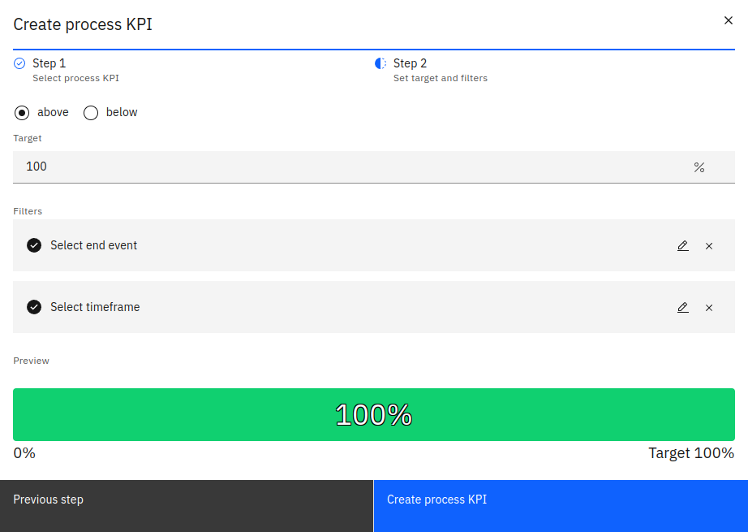
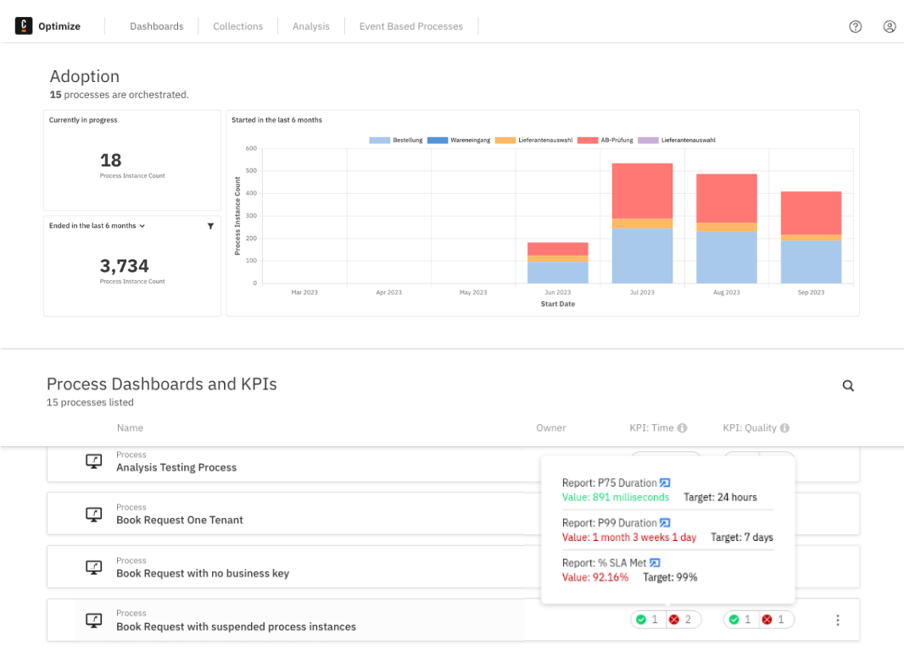

Key performance indicators (KPIs) are reports represented by single numerical values with predefined targets.
To create a custom KPI, follow the steps below:

1. On the right side of the **Collections** page, select **Create New > Report > Process KPI**.
2. Select one of the predefined KPI templates and the process you’d like to analyze.

3. Set the target value that you would like to achieve
4. Define the required filters.

5. Click **Create process KPI**.
6. (Optional) Edit the created KPI report and define your own filters/extra configuration.

## Setting existing process reports as KPIs

Existing process reports can be configured to act as a KPI. This can be done through the report configuration panel.
The checkbox to make the report a KPI is only visible for reports with a number visualization.

Once a report is set as a KPI, its status is visible on the **Dashboards** page.

