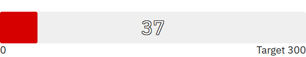
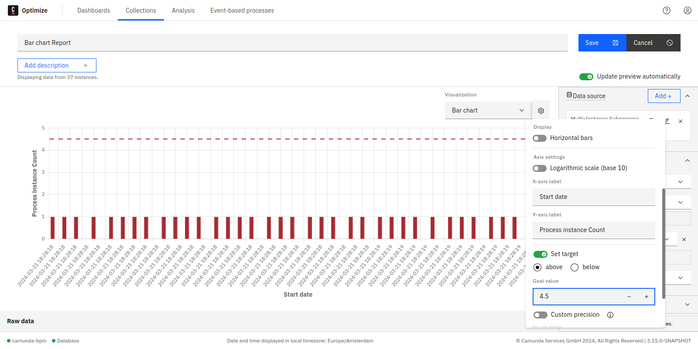
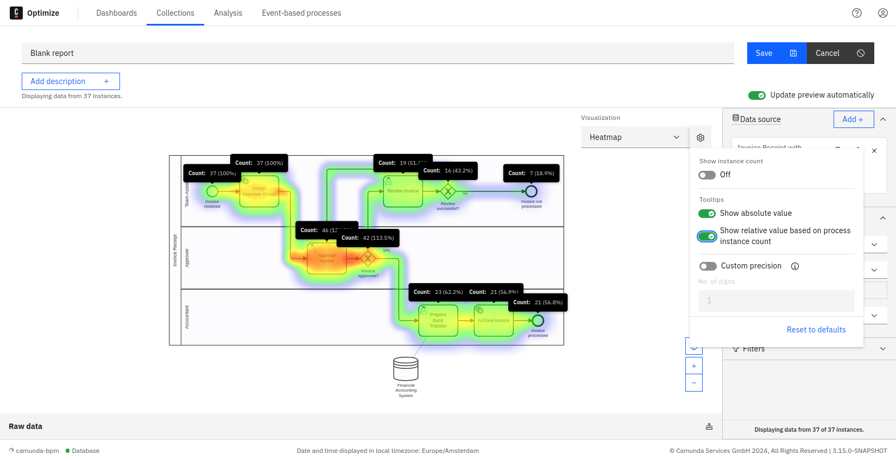

The configuration panel groups all the settings that can be applied to a report in one place. To see the panel, click on the cog button available in the edit mode of any report. Every visualization has different settings that can be configured in the panel.

When you save changes to the report configuration, they apply to the report view mode and any dashboard this report is displayed on.

## Number

Number reports are any reports that are visualized as a single number (e.g. `Process Instance: Count` grouped by `None` or `Process Instance: Duration` Grouped by `None`).

In number reports, the following configurations are possible:

## Number precision

Number precision can be configured from the panel to limit the most significant units to be shown.

For example, we have a report that calculates the total process instances duration. When the precision limit is not set, you will see all possible units, e.g.: `1y 5m 2wk 5d 3h 16min 3s 170ms`. In case you are only interested in certain units - e.g. months - you can omit all insignificant units by limiting the precision as shown in the figure below:

## Number goal value (progress bar)

Number reports appear as progress bar when the goal option is enabled from the panel as shown. The baseline and the target value of the progress bar can be also set using the panel.

You can toggle between the progress bar and the single number visualization using the same goal line switch.

A red line indicator appears on the progress bar when its value exceeds the goal value. On the right side of the indicator, the bar turns into a darker color to clearly show the exceeded amount.

## Table settings

In table reports, the following configurations are possible:

## Show instance count

Displays the total instance count on the right side of the visualization. If you save the report while this option is enabled, the number will also be shown on any dashboard this report is added to and when the report is shared.

## Hide, show, and reorder table columns

The table settings allow you to hide specific columns using the configuration menu as shown in the figure below:

When working with raw data table reports, you can also re-order the table columns using drag-and-drop on the header of the respective column.

## Sorting by table column

To sort a table by a specific column, click on the header of that column. Doing that will show a small caret icon in the header of the column indicating which column the table is currently sorted by and the direction of this sorting (ascending or descending) as shown:

Clicking again on the same column header will reverse the direction of sorting.

Saving the reports will also preserve the applied sorting.

The sorting currently works for all table reports except for:

- Combined table reports
- Reports grouped by integer type variables

## Absolute and relative values

When configuring a count report, you have the opportunity to configure which columns are included in the table. You can hide or show the corresponding columns using the switches for absolute and relative value.

## Custom bucket size for date variables

When evaluating a report which is grouped by a date variable and displayed as a table, Optimize offers you the option to select your preferred unit specifying the custom result bucket size from the report configuration menu. The available units are year, month, week, day, and automatic.

The default unit is automatic, which will create evenly spaced result buckets based on the values of the date variable. This configuration option is also available for charts.

## Custom bucket size and baseline

When evaluating a report which is grouped by duration or a number variable, Optimize offers you the option to specify your preferred result bucket size as well as a custom baseline in the report configuration menu. The bucket size determines the width of one bucket, and the baseline specifies the start of the first bucket.

For example, say a report contains the variable values 0.3, 6, and 13, and you set a bucket size of 5. By default, Optimize would now return a bucket for the values 0.3 to 5.3, one for 5.3 to 10.3, and one for 10.3 to 15.3. You may prefer your bucket start and end points to be a round number, in which case you should set your baseline to 0. With a baseline of 0 and bucket size 5, the result buckets now span 0 to 5, 5 to 10, and 10 to 15.

If these configuration fields are not set, by default Optimize will create evenly spaced result buckets with a range based on the minimum and maximum values of the number variable.

This configuration option is also available for charts.

## Charts (line, bar, pie)

In bar chart and line chart reports, it is possible to select the color of the graph, add names to the x-axis and y-axis, and edit many other settings as shown in the figure below:

In charts, you can hide/show absolute and relative values that appear in the tooltips.

## Show instance count

Displays the total instance count on the right side of the visualization. If you save the report while this option is enabled, the number will also be shown on any dashboard this report is added to and when the report is shared.

## Chart goal line

Optimize allows you to set a goal line in bar chart and line chart visualizations. Using this feature, it is possible to highlight anything above or below a certain value.

A good use case for such functionality is the following example:

First, go to the edit mode of a report and choose the following configuration:

| View         | Count frequency of process instance   |
| ------------ | ------------------------------------- |
| Group by     | Start date of process instance: Month |
| Visualize as | Bar chart                             |

Let us say that the number of completed process instances should always be above six. A goal line can be used as follows:

Set the target value input field to six and select the above button. If the number of process instances is below six, it will be highlighted in red as shown:

This feature can be also used with every other bar chart and line chart visualization. Here is another example where the target value is used with line chart visualization:

## Custom bucket size for date variables

When evaluating a report which is grouped by a date variable and displayed as a chart, Optimize offers you the option to select your preferred unit specifying the custom result bucket size in the report configuration menu.

The available units are year, month, week, day, and automatic. The default unit is automatic, which will create evenly spaced result buckets based on the values of the date variable. This configuration option is also available for tables.

## Custom bucket size and baseline

When evaluating a report which is grouped by duration or a number variable, Optimize offers you the option to specify your preferred result bucket size as well as a custom baseline in the report configuration menu. The bucket size determines the width of one bucket, and the baseline specifies the start of the first bucket.

For example, say a report contains the variable values 0.3, 6, and 13 and you set a bucket size of 5. By default, Optimize would now return a bucket for the values 0.3 to 5.3, one for 5.3 to 10.3, and one for 10.3 to 15.3. You may prefer your bucket start and end points to be a round number, in which case you should set your baseline to 0. With a baseline of 0 and bucket size 5, the result buckets now span 0 to 5, 5 to 10, and 10 to 15.

If these configuration fields are not set, Optimize will create evenly spaced result buckets with a range based on the minimum and maximum values of the number variable by default.

This configuration option is also available for tables.

## Stacked bar chart

When evaluating a report which has a second "Group by", Optimize offers you the option to stack the bar chart bars instead of displaying them near each other. Stacking bars would be useful when the focus of the chart is to compare the totals (e.g. flow node count, process instance count, etc.) and one part of the totals (e.g. flow node, variable value, etc.)

This configuration option is also available for bar/line charts.

## Switch bar chart orientation

When evaluating a report, Optimize will automatically set the bar chart orientation according the nature of the data being displayed. You can also switch the orientation manually using the configuration option shown.

## Bar/line chart

When evaluating a report which has both count and duration measures, Optimize offers you the option to display one of the measures as bars and the other measure as a line. This would help to differentiate between duration and count values displayed in the visualization. By default, the count measure is displayed as bars and the duration as a line. You can also switch between them by using the configuration option shown.

## Heatmaps

When enabling absolute or relative values switches, all tooltips for all flow nodes stay visible. This is also possible when you have defined target values. If you save the report in this state, the tooltips will also be shown on any dashboard this report is added to.

As for charts and table reports, it is possible to display the total instance count on the right-hand side of the visualization. If you save the report while this option is enabled, the number will also be shown on any dashboard this report is added to and when the report is shared.
