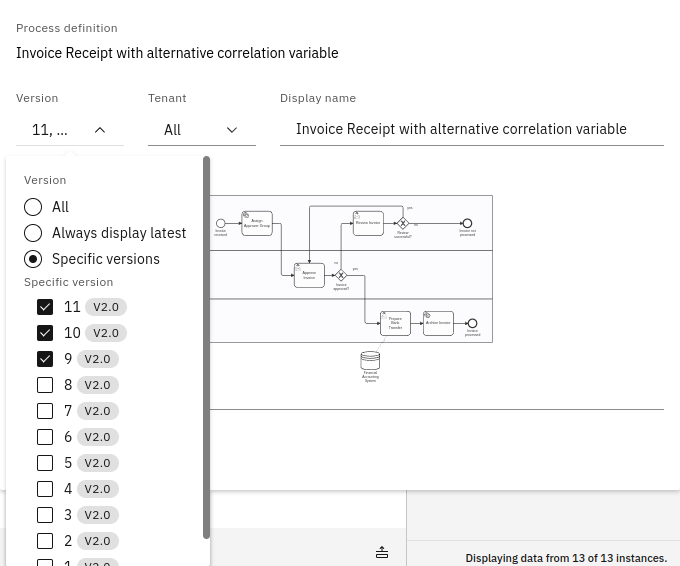

Every report relates to one or multiple process definitions, versions, and tenants. You must choose at least one process definition you want to create a report for.

To add a process definition to the report, click **Add** at the top of the **Data Source** section of the report control panel. This opens a dialog showing all process definitions you can use in the report. You can select up to 10 definitions to add to the report. If there are many process definitions, you can use the input field to search for the definition you are looking for.

For every added process definition, you can set a display name and a specific version or version range. To do so, click the **Edit** button in the process definition card. There are also buttons to remove the definition from the report or add a copy of the definition.

When editing a process definition, using the version dropdown, you can choose between all versions, the latest version, or a specific set of versions.

- **All** option: Every process instance across all versions of the process definition will be considered in your report.
- **Always display latest** option: Makes your report always refer to the latest version. Keep in mind that if a new version of the process is deployed, the report will automatically consider process instances of this new version only.
- **Specific version** option: Specify one or multiple existing versions of the process.

Data from older versions is mapped to the most recent version in the selection. Therefore, the report data can seem to be inconsistent, which is due to changes that occurred within the diagram through the different versions. For example, the old versions do not contain newly added tasks or a part of the diagram was removed because it was considered to be obsolete.

By default, all process instances for the selected process definitions are included in a report. You can reduce this set of process instances by applying a [filter](../../process-analysis/filters.md).
