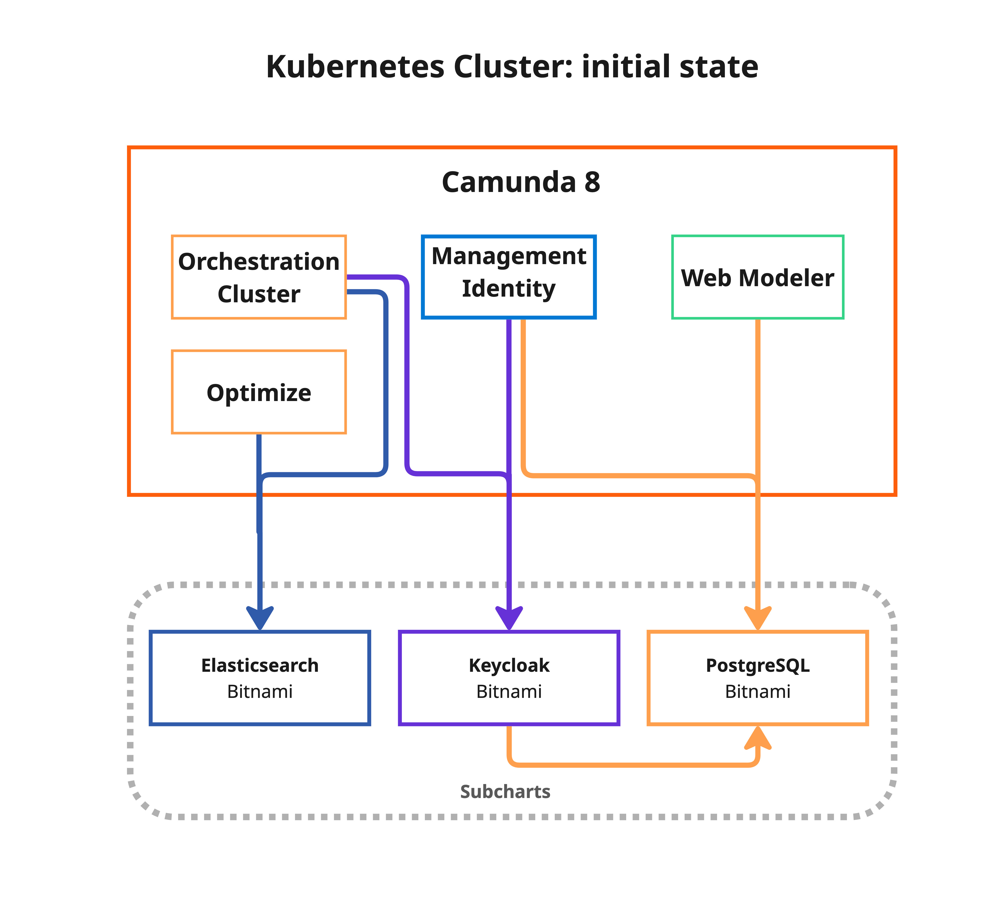
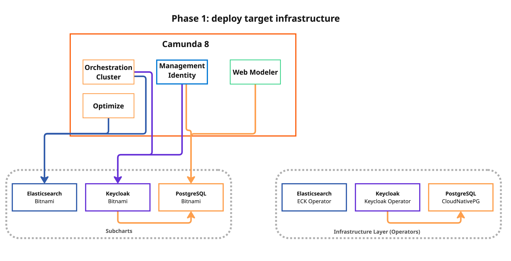
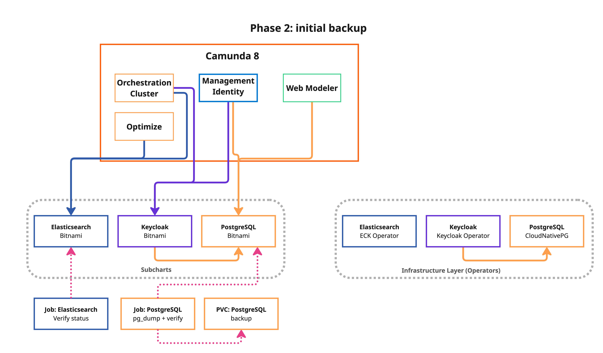
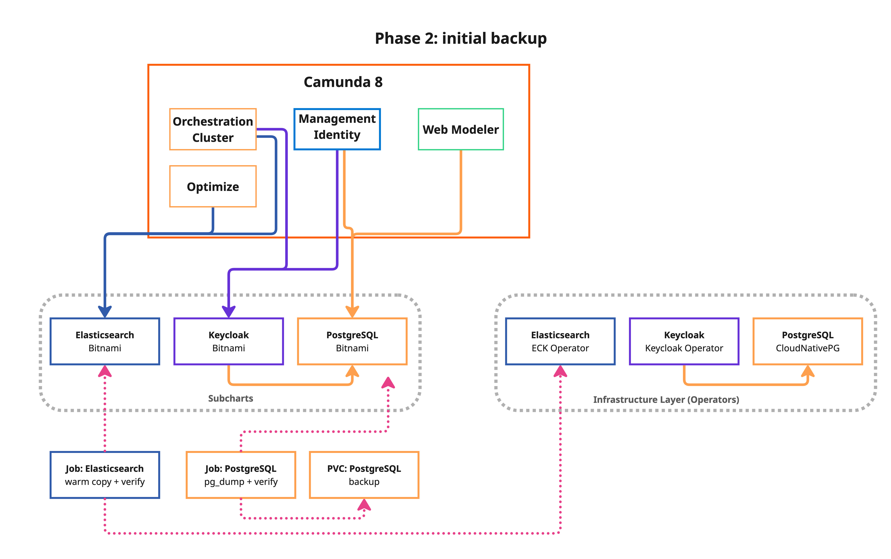
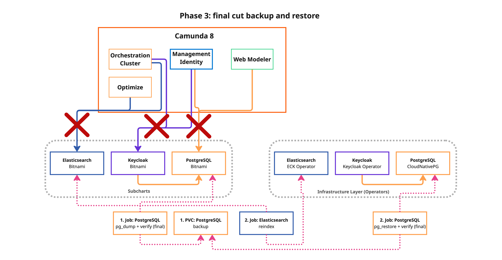
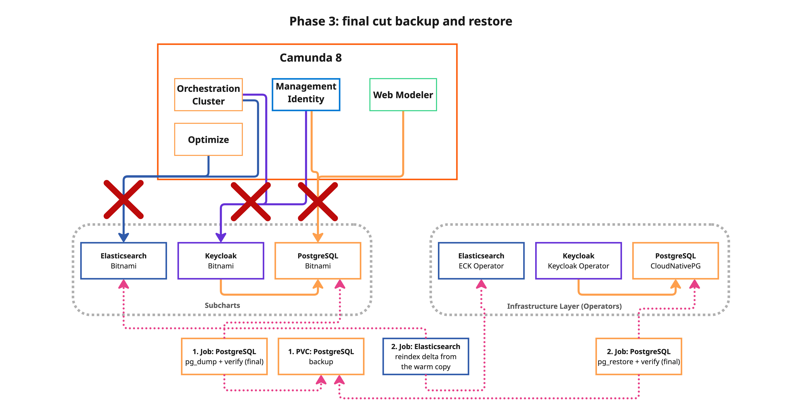
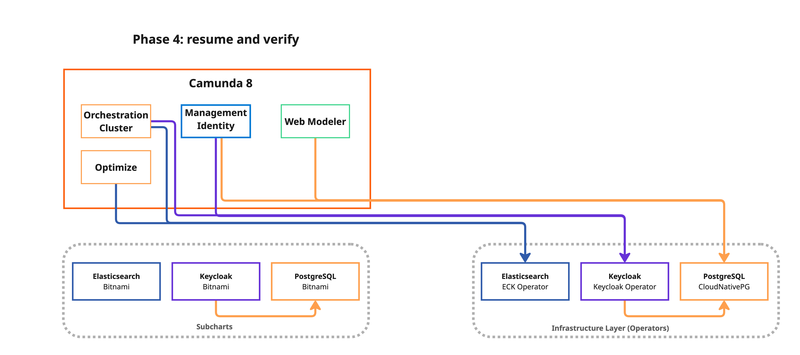
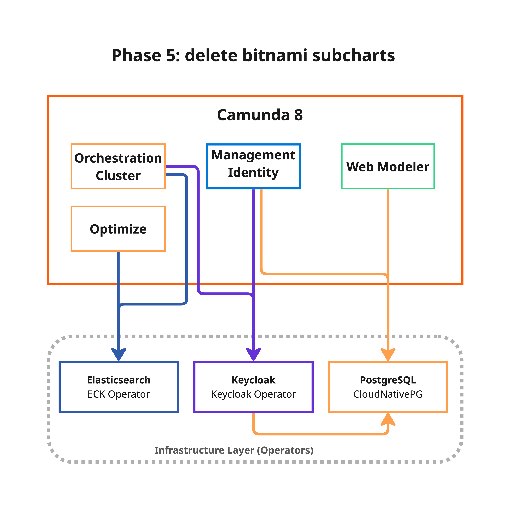

import Tabs from "@theme/Tabs";
import TabItem from "@theme/TabItem";
import FailbackCaution from './\_partials/\_ops-failback-caution.md'
import DryRunCommands from './\_partials/\_ops-dry-run-commands.md'
import CommonPrerequisites from './\_partials/\_common-prerequisites.md'
import CloneRepo from './\_partials/\_clone-repo.md'
import ChooseMigrationStrategy from './\_partials/\_choose-migration-strategy.md'
import MeasureEstimate from './\_partials/\_measure-estimate.md'

Migrate a Camunda 8 Helm installation from Bitnami-managed infrastructure (PostgreSQL, Elasticsearch, and Keycloak) to **Kubernetes operator-managed equivalents**:

- **[CloudNativePG](https://cloudnative-pg.io/)** for PostgreSQL
- **[Elastic Cloud on Kubernetes (ECK)](https://www.elastic.co/guide/en/cloud-on-k8s/current/index.html)** for Elasticsearch
- **[Keycloak Operator](https://www.keycloak.org/operator/installation)** for Keycloak

After migration, your setup will be aligned with the [operator-based reference architecture](/self-managed/deployment/helm/configure/operator-based-infrastructure.md).



## When to use this guide

This guide is intended for customers running Camunda 8 with Bitnami subcharts enabled. If your installation already uses external databases, managed services, or operator-managed infrastructure, you do not need to migrate from Bitnami subcharts.

Read the [topic overview](./index.md#why-migrate) to learn why you should migrate.

## Choose your migration strategy

<ChooseMigrationStrategy />

## Prerequisites

Before starting the migration, ensure you have the following [general prerequisites](./index.md#prerequisites-all-paths):

<CommonPrerequisites />

Additionally, the migration scripts require:

- [`envsubst`](https://www.man7.org/linux/man-pages/man1/envsubst.1.html) available (usually included in `gettext`)
- [`jq`](https://jqlang.github.io/jq/download/) installed
- [`yq`](https://github.com/mikefarah/yq) installed (for selective CloudNativePG cluster deployment)
- `base64` and `openssl` available (used for credential management)

For the tool versions used and tested, check the [.tool-versions](https://github.com/camunda/camunda-deployment-references/blob/stable/8.9/.tool-versions) file.

## Precautions

Review the [general precautions](./index.md#precautions) that apply to all migration paths.

:::tip Before running in production
Review the [operational readiness](#operational-readiness) checklist, including the staging rehearsal and pre-migration checklist, before starting a production migration.
:::

### Operator-specific precautions

These precautions are specific to the operator-based migration:

- **Monitor resource quotas:** CNPG and ECK clusters consume additional resources. Ensure your namespace quotas and node capacity allow for the temporary duplication.
- **Elasticsearch `reindex.remote.whitelist`:** The target ECK cluster must have `reindex.remote.whitelist` configured to allow pulling data from the source Bitnami Elasticsearch via the `_reindex` API. The migration scripts patch this automatically.
- **Keycloak hooks:** If you use a DNS CNAME for Keycloak, use the `hooks/post-phase-3.sh` hook to update the DNS target to the new Keycloak Operator service after cutover.

## Clone the deployment references repository

<CloneRepo />

## Step 1: Configure the migration

Edit `env.sh` to match your current Camunda installation:

<details>
<summary>Show details: `env.sh` reference</summary>

```bash reference
https://github.com/camunda/camunda-deployment-references/blob/stable/8.9/generic/kubernetes/migration/env.sh
```

</details>

### Key configuration variables

| Variable                     | Default                | Description                                                                                               |
| ---------------------------- | ---------------------- | --------------------------------------------------------------------------------------------------------- |
| `NAMESPACE`                  | `camunda`              | Kubernetes namespace of your Camunda installation                                                         |
| `CAMUNDA_RELEASE_NAME`       | `camunda`              | Helm release name                                                                                         |
| `CAMUNDA_HELM_CHART_VERSION` | (chart version)        | Target Helm chart version for the upgrade                                                                 |
| `CAMUNDA_DOMAIN`             | (empty)                | Domain for Keycloak Ingress. Leave empty for port-forward setups                                          |
| `IDENTITY_DB_NAME`           | `identity`             | Identity database name (must match the source installation)                                               |
| `IDENTITY_DB_USER`           | `identity`             | Identity database user (must match the source installation)                                               |
| `KEYCLOAK_DB_NAME`           | `keycloak`             | Keycloak database name (must match the source installation)                                               |
| `KEYCLOAK_DB_USER`           | `keycloak`             | Keycloak database user (must match the source installation)                                               |
| `WEBMODELER_DB_NAME`         | `webmodeler`           | Web Modeler database name (must match the source installation)                                            |
| `WEBMODELER_DB_USER`         | `webmodeler`           | Web Modeler database user (must match the source installation)                                            |
| `BACKUP_PVC`                 | `migration-backup-pvc` | PVC name for storing backup data                                                                          |
| `BACKUP_STORAGE_SIZE`        | `50Gi`                 | Backup PVC size (must fit all database dumps)                                                             |
| `MIGRATE_IDENTITY`           | `true`                 | Enables the Identity PostgreSQL database migration                                                        |
| `MIGRATE_KEYCLOAK`           | `true`                 | Enables the Keycloak and its PostgreSQL database migration                                                |
| `MIGRATE_WEBMODELER`         | `true`                 | Enables the Web Modeler PostgreSQL database migration                                                     |
| `MIGRATE_ELASTICSEARCH`      | `true`                 | Enables the Elasticsearch data migration                                                                  |
| `ES_WARM_REINDEX`            | `false`                | When `true`, pre-copies ES data during Phase 2 (no downtime), reducing Phase 3 to a ~5 minute delta sync. |

Set any `MIGRATE_*` variable to `false` to skip a component. This is useful, for example, if the component isn't deployed or already uses an external service.

### Operator-specific variables

These variables control the operator deployments. Defaults work for most setups:

| Variable                  | Default          | Description                              |
| ------------------------- | ---------------- | ---------------------------------------- |
| `CNPG_OPERATOR_NAMESPACE` | `cnpg-system`    | Namespace for the CloudNativePG operator |
| `ECK_OPERATOR_NAMESPACE`  | `elastic-system` | Namespace for the ECK operator           |
| `CNPG_IDENTITY_CLUSTER`   | `pg-identity`    | CNPG cluster name for Identity           |
| `CNPG_KEYCLOAK_CLUSTER`   | `pg-keycloak`    | CNPG cluster name for Keycloak           |
| `CNPG_WEBMODELER_CLUSTER` | `pg-webmodeler`  | CNPG cluster name for Web Modeler        |
| `ECK_CLUSTER_NAME`        | `elasticsearch`  | ECK Elasticsearch cluster name           |

### Source `env.sh`

Once you've configured the environment variables, source the file:

```bash
source env.sh
```

## Step 2: Customize operator manifests

Before running the migration, **you must review and customize** the operator-based manifests to match your production requirements. The migration deploys operators and instances using these manifests. The default settings may not be appropriate for your workload.

Follow this guidance while reviewing the manifests:

| Component     | Must review before production                                              | Defaults may be acceptable for                          |
| ------------- | -------------------------------------------------------------------------- | ------------------------------------------------------- |
| PostgreSQL    | Storage size, replica count, CPU and memory, connection-related parameters | Short-lived staging rehearsals with representative data |
| Elasticsearch | Node count, storage size, JVM and resource limits                          | Dry runs where you only validate the workflow           |
| Keycloak      | Hostname, Ingress or route mode, replica count, resource limits            | Non-production validation only                          |

If you are rehearsing the migration for the first time, keep the manifests simple but ensure storage is at least as large as the existing Bitnami volumes. Before production, revisit the sizing based on the timings and load observed during rehearsal.

### PostgreSQL (CloudNativePG)

Review the CloudNativePG (CNPG) cluster specifications in `operator-based/postgresql/postgresql-clusters.yml`. Key settings to verify:

- Storage size (must be >= your current Bitnami PVC sizes)
- Number of replicas
- PostgreSQL version
- Resource requests and limits
- PostgreSQL parameters (for example, `shared_buffers` and `max_connections`)

<details>
<summary>Show details: CloudNativePG manifest reference</summary>

```yaml reference
https://github.com/camunda/camunda-deployment-references/blob/stable/8.9/generic/kubernetes/operator-based/postgresql/postgresql-clusters.yml
```

</details>

### Elasticsearch (ECK)

The migration patches the reference ECK cluster manifest from `operator-based/elasticsearch/elasticsearch-cluster.yml` at runtime to add `reindex.remote.whitelist` support for data transfer via the `_reindex` API. Review the base manifest:

- Node count
- Storage size (must be >= your current Bitnami ES PVC size)
- Resource requests and limits

<details>
<summary>Show details: Elasticsearch manifest reference</summary>

```yaml reference
https://github.com/camunda/camunda-deployment-references/blob/stable/8.9/generic/kubernetes/operator-based/elasticsearch/elasticsearch-cluster.yml
```

</details>

### Keycloak

Review the Keycloak Custom Resource in `operator-based/keycloak/`. For the broader deployment context and Helm values layering, see [operator-based infrastructure](/self-managed/deployment/helm/configure/operator-based-infrastructure.md#keycloak-deployment). Choose the appropriate variant:

- [`keycloak-instance-domain-nginx.yml`](https://github.com/camunda/camunda-deployment-references/blob/stable/8.9/generic/kubernetes/operator-based/keycloak/keycloak-instance-domain-nginx.yml) — if you have a domain with nginx Ingress
- [`keycloak-instance-domain-openshift.yml`](https://github.com/camunda/camunda-deployment-references/blob/stable/8.9/generic/kubernetes/operator-based/keycloak/keycloak-instance-domain-openshift.yml) — for OpenShift deployments with Routes
- [`keycloak-instance-no-domain.yml`](https://github.com/camunda/camunda-deployment-references/blob/stable/8.9/generic/kubernetes/operator-based/keycloak/keycloak-instance-no-domain.yml) — for port-forward setups

Key settings to verify:

- Replicas
- Resource limits
- Hostname configuration

:::info Keycloak 26 hostname configuration
The Keycloak Custom Resource uses the v2 hostname provider (Keycloak 25+). The `hostname` field must include the full URL with scheme and path — for example, `https://your-domain.example.com/auth`. This ensures that the OIDC issuer URL is consistent and includes the `/auth` path prefix used by `http-relative-path`. The v1 hostname provider (Keycloak 24 and earlier) is not compatible with these manifests.
:::

## Step 3: Run the migration

The migration follows five sequential phases. Each phase is idempotent and can, therefore, be rerun safely.

### Phase 1: Deploy target infrastructure (no downtime)



This phase installs the Kubernetes operators and creates the target clusters alongside your existing Bitnami components. Your application continues to run normally:

```bash
bash 1-deploy-targets.sh
```

What happens:

1. The script displays a customization warning and asks for confirmation.
2. It validates target resource allocations (CPU, memory, and PVC sizes) against your current Bitnami StatefulSets.
3. It installs the **CloudNativePG operator** and creates PostgreSQL clusters for each component.
4. It installs the **ECK operator** and creates an Elasticsearch cluster with `reindex.remote.whitelist` configured for data migration via the `_reindex` API.
5. It installs the **Keycloak Operator** and creates the Keycloak Custom Resource.

The script only deploys operators for components that are being migrated. For example, if `MIGRATE_ELASTICSEARCH=false`, the ECK operator is not installed.

All targets are created empty; no traffic is routed to them yet.

<details>
<summary>Show details: Phase 1 script reference</summary>

```bash reference
https://github.com/camunda/camunda-deployment-references/blob/stable/8.9/generic/kubernetes/migration/1-deploy-targets.sh
```

</details>

### Phase 2: Initial backup (no downtime)

<Tabs groupId="migration-strategy" queryString="strategy">
<TabItem value="standard" label="Standard">



</TabItem>
<TabItem value="warm-reindex" label="Reduced downtime (warm reindex)" default>



</TabItem>
</Tabs>

This phase takes a backup of all data sources while the application is still running. This reduces the cutover window in Phase 3.

```bash
bash 2-backup.sh
```

<Tabs groupId="migration-strategy" className="tabs-hidden" queryString="strategy">
<TabItem value="standard" label="Standard">

What happens:

1. **PostgreSQL**: A `pg_dump` Kubernetes Job is created for each component (Identity, Keycloak, and Web Modeler).
2. **Elasticsearch (ES)**: A verification job checks source ES health and lists all Camunda indices to be migrated.
3. All backup data is stored on a shared Persistent Volume Claim (PVC).

</TabItem>
<TabItem value="warm-reindex" label="Reduced downtime (warm reindex)" default>

What happens:

1. **PostgreSQL**: A `pg_dump` Kubernetes Job is created for each component (Identity, Keycloak, and Web Modeler).
2. **Elasticsearch (ES)**: A verification job checks source ES health and lists all Camunda indices to be migrated.
3. **Elasticsearch warm reindex**: A full reindex from the source Bitnami ES to the target is performed while the application is still running. This pre-populates the target with all existing data so Phase 3 only needs a fast delta reindex. The warm reindex may take a significant amount of time depending on your data volume, but it runs **without any downtime**.
4. All backup data is stored on a shared Persistent Volume Claim (PVC).

</TabItem>
</Tabs>

Reference templates used in this phase:

<details>
<summary>Show details: PostgreSQL backup job template</summary>

```yaml reference
https://github.com/camunda/camunda-deployment-references/blob/stable/8.9/generic/kubernetes/migration/jobs/pg-backup.job.yml
```

</details>

<details>
<summary>Show details: Elasticsearch verification job template</summary>

```yaml reference
https://github.com/camunda/camunda-deployment-references/blob/stable/8.9/generic/kubernetes/migration/jobs/es-backup.job.yml
```

</details>

<details>
<summary>Show details: Phase 2 script reference</summary>

```bash reference
https://github.com/camunda/camunda-deployment-references/blob/stable/8.9/generic/kubernetes/migration/2-backup.sh
```

</details>

### Phase 3: Cutover (downtime required)

<Tabs groupId="migration-strategy" queryString="strategy">
<TabItem value="standard" label="Standard">



</TabItem>
<TabItem value="warm-reindex" label="Reduced downtime (warm reindex)" default>



</TabItem>
</Tabs>

:::warning Maintenance window required
This is the only phase that causes downtime. Schedule a maintenance window before proceeding.

<Tabs groupId="migration-strategy" className="tabs-hidden" queryString="strategy">
<TabItem value="standard" label="Standard">

Downtime typically lasts **5–60 minutes**, depending on Elasticsearch data volume. See [downtime estimation](#downtime-estimation) for benchmarked timings.

</TabItem>
<TabItem value="warm-reindex" label="Reduced downtime (warm reindex)" default>

With `ES_WARM_REINDEX=true`, downtime is reduced to **~5 minutes** regardless of Elasticsearch data volume. Phase 3 only syncs the delta written since the warm reindex in Phase 2.

</TabItem>
</Tabs>
:::

:::tip Measure downtime before the real cutover
You can run `bash 3-cutover.sh --estimate` to measure the actual cutover duration on your environment **without causing any downtime**. This runs the real data operations (PG backup/restore and ES reindex) against the target infrastructure but skips freezing the application and the Helm upgrade. See [Measure with `--estimate`](#measure-with---estimate) for details.
:::

```bash
bash 3-cutover.sh
```

<Tabs groupId="migration-strategy" className="tabs-hidden" queryString="strategy">
<TabItem value="standard" label="Standard">

What happens:

1. **Save** current Helm values for rollback.
2. **Freeze** all Camunda deployments and StatefulSets (scale to zero replicas).
3. **Final backup** — consistent backup with no active connections to ensure data integrity.
4. **Restore** data to the new operator-managed targets:
   - `pg_restore` to CNPG clusters for each PostgreSQL database.
   - Elasticsearch **full reindex from remote** — all indices are copied from the source Bitnami ES to the ECK cluster using the `_reindex` API. This is the dominant factor in downtime duration.
5. **Sync Keycloak admin credentials** — copies the restored admin password to the Keycloak Operator secret so Keycloak and Identity stay in sync.
6. **Helm upgrade** — reconfigures Camunda to use the new backends and restarts all components.

</TabItem>
<TabItem value="warm-reindex" label="Reduced downtime (warm reindex)" default>

What happens:

1. **Save** current Helm values for rollback.
2. **Freeze** all Camunda deployments and StatefulSets (scale to zero replicas).
3. **Final backup** — consistent backup with no active connections to ensure data integrity.
4. **Restore** data to the new operator-managed targets:
   - `pg_restore` to CNPG clusters for each PostgreSQL database.
   - Elasticsearch **delta reindex** — only documents written between Phase 2 (warm reindex) and the freeze are synced. This uses `version_type=external` with `conflicts=proceed` to skip documents already present on the target, making it dramatically faster than a full reindex.
5. **Sync Keycloak admin credentials** — copies the restored admin password to the Keycloak Operator secret so Keycloak and Identity stay in sync.
6. **Helm upgrade** — reconfigures Camunda to use the new backends and restarts all components.

</TabItem>
</Tabs>

Reference templates used in this phase:

<details>
<summary>Show details: PostgreSQL restore job template</summary>

```yaml reference
https://github.com/camunda/camunda-deployment-references/blob/stable/8.9/generic/kubernetes/migration/jobs/pg-restore.job.yml
```

</details>

<details>
<summary>Show details: Elasticsearch restore job template</summary>

```yaml reference
https://github.com/camunda/camunda-deployment-references/blob/stable/8.9/generic/kubernetes/migration/jobs/es-restore.job.yml
```

</details>

<details>
<summary>Show details: Phase 3 script reference</summary>

```bash reference
https://github.com/camunda/camunda-deployment-references/blob/stable/8.9/generic/kubernetes/migration/3-cutover.sh
```

</details>

### Phase 4: Validate (no downtime)



```bash
bash 4-validate.sh
```

This phase verifies all components are healthy:

- All Camunda deployments and StatefulSets are ready.
- CNPG PostgreSQL clusters report a healthy state.
- ECK Elasticsearch cluster is in `Ready` phase with restored indices.
- Keycloak Custom Resource is ready.
- A migration report is generated at `.state/migration-report.md`.

<details>
<summary>Show details: Phase 4 script reference</summary>

```bash reference
https://github.com/camunda/camunda-deployment-references/blob/stable/8.9/generic/kubernetes/migration/4-validate.sh
```

</details>

:::warning Wait before cleanup
Do not move on to the next phase immediately after validation. Operate with the new infrastructure through at least one full business cycle (for example, a complete weekday with peak traffic) to confirm stability. Once Bitnami resources are deleted, rollback is no longer possible without restoring from backup. If you need to fail back, run `bash rollback.sh` **before** this phase (see [rollback](#rollback)).
:::

### Phase 5: Cleanup Bitnami resources (no downtime)



:::warning Destructive and irreversible
This phase **permanently deletes** old Bitnami StatefulSets, PVCs, and the migration backup PVC. After cleanup, rollback to Bitnami subcharts is **no longer possible**.

Before running this phase, strongly consider:

1. Taking a full backup of all databases (`pg_dumpall` or equivalent)
2. Taking PVC or storage volume snapshots (cloud provider snapshots)
3. Storing backups in cold storage—for example, S3 Glacier or GCS Archive
4. Keeping rollback artifacts in `.state/` as a safety net
   :::

After confirming the migration is successful, remove old Bitnami StatefulSets, PVCs, services, and the migration backup PVC:

```bash
bash 5-cleanup-bitnami.sh
```

What happens:

1. The script requires Phase 4 to be completed and displays a **destructive operation warning** with a confirmation prompt.
2. **Deletes old Bitnami PostgreSQL** StatefulSets, their PVCs, and headless services (for each migrated component: Identity, Keycloak, and Web Modeler).
3. **Deletes old Bitnami Elasticsearch** StatefulSet, PVCs, and services.
4. **Deletes old Bitnami Keycloak** StatefulSet.
5. **Deletes the migration backup PVC**.
6. **Reverifies** that all Camunda components and operator-managed targets remain healthy after cleanup.
7. Suggests removing the `reindex.remote.whitelist` setting from the ECK Elasticsearch configuration as a post-cleanup step.

The script checks whether each resource exists before attempting deletion, so it can be safely rerun if interrupted.

<details>
<summary>Show details: Phase 5 script reference</summary>

```bash reference
https://github.com/camunda/camunda-deployment-references/blob/stable/8.9/generic/kubernetes/migration/5-cleanup-bitnami.sh
```

</details>

## Migration hooks

The migration scripts support custom hooks that run before or after each phase. See [migration hooks](./index.md#migration-hooks) for the full reference and examples.

## Rollback

If the migration fails or produces unexpected results, you can roll back to the pre-cutover state:

```bash
bash rollback.sh
```

This restores the previous Helm values (re-enabling Bitnami subcharts) and restarts Camunda on the original infrastructure. The operator-managed resources (CNPG clusters, ECK, and Keycloak Custom Resource) are **not deleted**, allowing you to retry or debug.

<details>
<summary>Show details: Rollback script reference</summary>

```bash reference
https://github.com/camunda/camunda-deployment-references/blob/stable/8.9/generic/kubernetes/migration/rollback.sh
```

</details>

Rollback is available after Phase 3 (cutover). Before that, simply stop the migration; your Bitnami infrastructure is still active and untouched.

## Downtime estimation

Only Phase 3 (cutover) causes downtime. The estimates below were measured on minimal Kubernetes clusters with standard storage. **Production clusters with faster storage and networking will perform significantly better**. Always run a [staging rehearsal](#staging-rehearsal) with representative data volumes to measure your actual downtime.

<Tabs groupId="migration-strategy" queryString="strategy">
<TabItem value="standard" label="Standard">

### Reference timings

The following timings were observed migrating a Camunda 8 installation with all components (Identity, Keycloak, Web Modeler, and Elasticsearch):

| Data profile                 | ES data  | PG data (3 databases) | Observed downtime |
| ---------------------------- | -------- | --------------------- | ----------------- |
| Minimal (fresh install)      | < 100 MB | ~30 MB                | **~4 min**        |
| Large (~6.5 million ES docs) | ~9 GB    | ~30 MB                | **~40 min**       |

### Phase 3 breakdown

| Step                          | Duration    | Notes                                                                             |
| ----------------------------- | ----------- | --------------------------------------------------------------------------------- |
| Freeze components (scale → 0) | ~10 s       | Scale down all deployments and StatefulSets                                       |
| PostgreSQL backup + restore   | ~40 s       | `pg_dump` / `pg_restore` for all databases (usually negligible at moderate sizes) |
| **Elasticsearch reindex**     | **~38 min** | **(Dominant factor)** Copies all indices via the `_reindex` API                   |
| Helm upgrade + restart        | ~2 min      | Reconfigure backends and restart all components                                   |

### Estimates by Elasticsearch data volume

| ES Data Volume | Estimated Downtime  | Bottleneck                 |
| -------------- | ------------------- | -------------------------- |
| < 1 GB         | ~5 minutes          | Helm upgrade + pod startup |
| 1–10 GB        | ~10–40 minutes      | ES reindex                 |
| 10–50 GB       | ~40 minutes–2 hours | ES reindex                 |
| > 50 GB        | 2+ hours            | ES reindex                 |

### Key observations

- **Elasticsearch reindex dominates downtime.** With ~9 GB of ES data, the reindex step accounts for ~95% of the total cutover time. PostgreSQL backup and restore completes in under a minute regardless of reasonable data sizes.
- **Downtime scales linearly with ES data volume.** The largest indices — such as Optimize process instance history — drive the overall duration.
- **Your cluster will likely be faster.** These timings were measured on constrained test infrastructure. Production clusters with NVMe storage, dedicated nodes, and higher network bandwidth typically achieve much higher reindex throughput.
- **Always measure in staging.** Run the full migration on a staging environment with representative data volumes to get an accurate downtime estimate for your specific setup.

</TabItem>
<TabItem value="warm-reindex" label="Reduced downtime (warm reindex)" default>

### Reference timings

With `ES_WARM_REINDEX=true`, the bulk of the Elasticsearch data transfer happens during Phase 2 (no downtime). Phase 3 only needs a fast delta reindex to sync documents written between Phase 2 and the freeze:

| Data profile                 | ES data  | PG data (3 databases) | Observed downtime       |
| ---------------------------- | -------- | --------------------- | ----------------------- |
| Minimal (fresh install)      | < 100 MB | ~30 MB                | **~4 min**              |
| Large (~6.5 million ES docs) | ~9 GB    | ~30 MB                | **~5 min** (delta only) |

### Phase 3 breakdown (warm reindex)

| Step                          | Duration     | Notes                                                               |
| ----------------------------- | ------------ | ------------------------------------------------------------------- |
| Freeze components (scale → 0) | ~10 s        | Scale down all deployments and StatefulSets                         |
| PostgreSQL backup + restore   | ~40 s        | `pg_dump` / `pg_restore` for all databases                          |
| **ES delta reindex**          | **~1–2 min** | Only documents written after Phase 2 warm reindex need to be synced |
| Helm upgrade + restart        | ~2 min       | Reconfigure backends and restart all components                     |

### Estimates by Elasticsearch data volume

| ES Data Volume | Standard downtime   | Warm reindex downtime | Notes                                   |
| -------------- | ------------------- | --------------------- | --------------------------------------- |
| < 1 GB         | ~5 minutes          | ~5 minutes            | No significant benefit at small volumes |
| 1–10 GB        | ~10–40 minutes      | **~5 minutes**        | Warm reindex eliminates the bottleneck  |
| 10–50 GB       | ~40 minutes–2 hours | **~5 minutes**        | Most impactful reduction                |
| > 50 GB        | 2+ hours            | **~5 minutes**        | Critical for large data volumes         |

:::info Key observations

- **ES delta reindex is nearly instant.** After the warm reindex pre-copies all existing data in Phase 2, only new documents created between Phase 2 and the freeze need to be synced. The delta reindex uses `version_type=external` and `conflicts=proceed` to efficiently skip up-to-date documents.
- **Downtime becomes data-volume independent.** The dominant factor (ES reindex) is removed from the critical path. Downtime is determined by the freeze, PG restore, and Helm upgrade steps (~5 minutes total).
- **Phase 2 takes longer.** The warm reindex adds runtime to Phase 2 proportional to your ES data volume, but this runs without any downtime.
  :::

</TabItem>
</Tabs>

### Measure with `--estimate`

<MeasureEstimate />

## Operational readiness

Before running this migration in production, use the checklist below to reduce risk and confirm the cutover plan is ready.

### Staging rehearsal

1. **Clone your production environment** to a staging cluster with the same Helm chart version, same component configuration, and comparable data volumes.
2. **Run the full migration end to end** in staging, including all five phases: deploy, backup, cutover, validate, and cleanup.
3. **Measure actual timings**: record how long each phase takes, especially the `3-cutover.sh` phase, as it determines your downtime window. The [benchmarked timings](#downtime-estimation) show that Elasticsearch reindex dominates. Expect downtime to scale linearly with your ES data volume.
4. **Test rollback**: after a successful staging migration, intentionally run `bash rollback.sh` to verify you can revert cleanly.

:::tip
Use a representative data set; empty databases migrate in seconds but do not reveal the Elasticsearch reindex bottleneck that large datasets will. As a reference, ~9 GB of ES data takes ~40 min on minimal test infrastructure, whereas production clusters with faster storage and networking will perform significantly better.
:::

### Production dry-run

<DryRunCommands />

Review the output carefully. Ensure that all Kubernetes resources, secrets, and Helm values match your expectations before removing `--dry-run`.

### Pre-migration checklist

Before starting the migration in production:

- **Notify stakeholders**: announce the maintenance window at least 48 hours in advance. Include expected start time, duration (measured in staging), and impact on end users.
- **Verify backups**: confirm your existing backup strategy (Velero, volume snapshots, or cloud provider backups) has a recent successful backup. The migration creates its own backup, but an independent one provides an additional safety net.
- **Scale down non-essential consumers**: if you have external systems consuming Camunda APIs, consider pausing them during the freeze window to prevent data inconsistencies.
- **Check cluster resources**: ensure the cluster has enough CPU, memory, and storage to run both old and new infrastructure simultaneously during the migration—both exist briefly.
- **Review `env.sh`**: double-check all variables, especially `NAMESPACE`, `CAMUNDA_RELEASE_NAME`, `PG_TARGET_MODE`, and `ES_TARGET_MODE`.
- **Monitor readiness**: have dashboards open for cluster health, pod status, and storage capacity.

### Failback procedure

If the migration succeeds but you discover issues in the hours or days following:

1. **Immediate failback** (before Phase 5 when Bitnami PVCs still exist): run `bash rollback.sh` to revert the Helm values and re-attach to the original Bitnami StatefulSets.
2. **Late failback** (after Phase 5 when Bitnami PVCs have been deleted): restore from the backup taken during Phase 2 or from your independent backup.

<FailbackCaution />

### Data safety measures

- All `pg_dump` backups are stored on a dedicated PVC (`migration-backup-pvc`) that persists independently of the migration.
- Elasticsearch snapshots are stored in a registered repository and retained according to the configured retention policy.
- The migration scripts are **idempotent**: rerunning a phase that was interrupted picks up where it left off.
- No Bitnami resources are deleted during Phases 1–4; they're only disconnected from the Helm release. Phase 5 explicitly removes them after validation.

### Post-migration monitoring

After completing the migration, monitor the following for at least 48 hours:

- **Pod restarts**: `kubectl get pods -n ${NAMESPACE} --watch`
- **CNPG cluster health**: `kubectl get clusters -n ${NAMESPACE}` (should show `Cluster in healthy state`)
- **ECK cluster health**: `kubectl get elasticsearch -n ${NAMESPACE}` (should show `green`)
- **Camunda component logs**: check for connection errors, authentication failures, or data inconsistencies.
- **Process instance completion**: verify that in-flight process instances continue to execute correctly.
- **Zeebe export lag**: confirm that Zeebe exporters are writing to the new Elasticsearch without delays.

## Troubleshooting

### A migration job fails

Check the job logs for details:

```bash
# List migration jobs
kubectl get jobs -n ${NAMESPACE} -l migration.camunda.io/type

# View logs for a specific job
kubectl logs -n ${NAMESPACE} job/<job-name>

# Describe the job for events
kubectl describe job <job-name> -n ${NAMESPACE}
```

Each phase is idempotent; you can rerun it after fixing the issue.

### PostgreSQL restore fails with permission errors

When restoring to CNPG, the `pg_restore` command uses `--no-owner --no-privileges` flags to avoid permission mismatches. If you see errors related to ownership, verify that the target database user has the correct permissions:

```bash
kubectl exec -it <cnpg-primary-pod> -n ${NAMESPACE} -- psql -U postgres -c "\\du"
```

### Elasticsearch reindex fails

The ES restore uses the `_reindex` API to pull data from the source Bitnami Elasticsearch to the target ECK cluster. Both clusters must be reachable within the same namespace. Check that the source ES is still running and accessible:

```bash
# Check if source ES is reachable from the target
kubectl exec -it <eck-pod> -n ${NAMESPACE} -- \
  curl -s http://${CAMUNDA_RELEASE_NAME}-elasticsearch:9200/_cluster/health
```

If the reindex fails for specific indices, check the job logs for mapping conflicts or timeout errors. You can delete the problematic indices on the target and rerun Phase 3.

### Migration status check

View the current migration progress:

```bash
bash 1-deploy-targets.sh --status
```

This shows which phases have been completed and their timestamps.

### State tracking

The scripts maintain migration state in `.state/migration.env`, a plain key-value file that records phase completion timestamps and deployment decisions. Each run appends to `.state/migration-YYYY-MM-DD.log`. The `.state/` directory is local and gitignored. To reset state and start over, run:

```bash
rm -rf .state/
```
